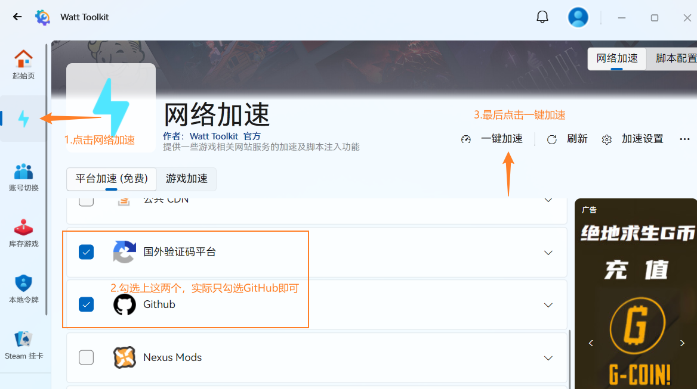
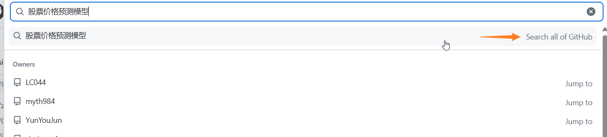
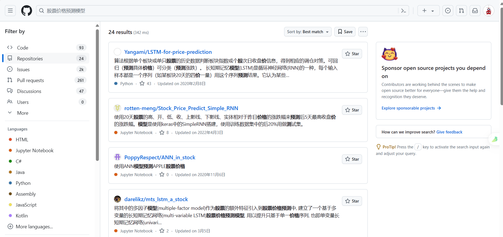
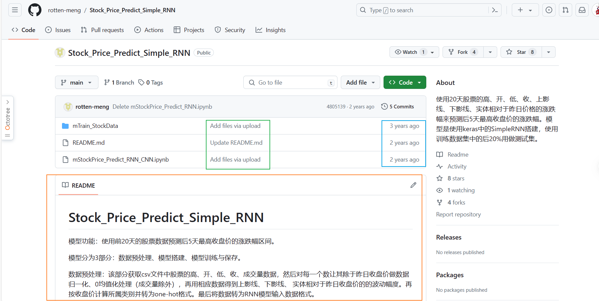
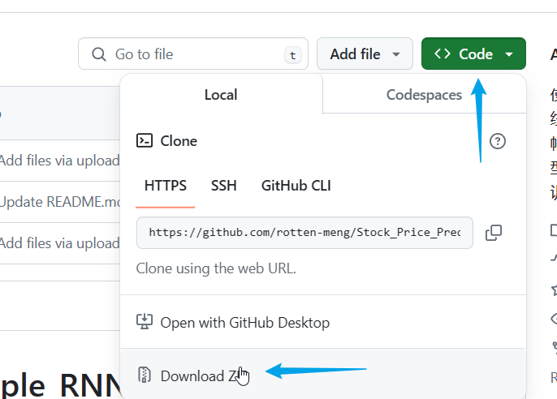
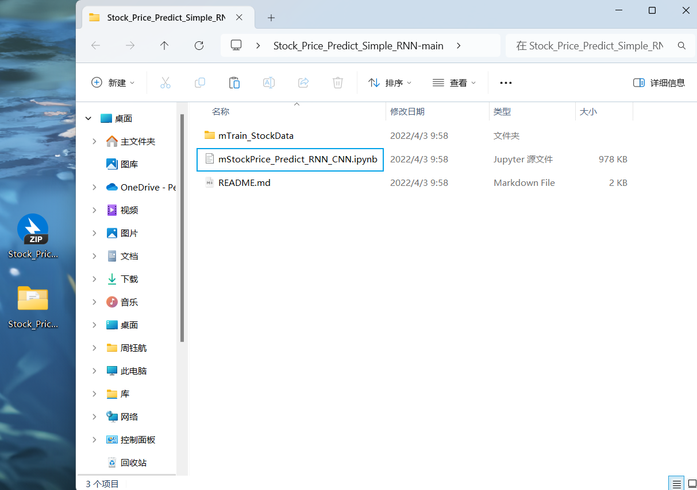

# 使用github搜寻项目并下载

## 前言

教程还是很简陋的，速成应付作业还是可以的，并非真正的GitHub速通教程

## 加速github

github在国内有时加载很慢，为了稳定的访问，在此推荐一个免费加速器👇👇👇

​															[Watt Toolkit]([瓦特工具箱(Steam++官网) - Watt Toolkit (steampp.net)](https://steampp.net/))

1. 安装完毕后，初始界面如下：

2. 加速GitHub。~~首先排除这是个游戏加速器~~

3. 加速完成后，打开[GitHub](https://github.com/)

---

## 搜索相关项目＆下载

1. 打开GitHub后，页面如下

2. 最上方进行仓库搜索，以**股票价格预测模型**为例

   搜索结果如下：

​      在左侧**Languages**中可以挑选自己想要的语言

3. 点击仓库即可进入查看代码等信息。以上图第二个为例，[传送门](https://github.com/rotten-meng/Stock_Price_Predict_Simple_RNN)

- 橙色框内为仓库说明，即仓库内的README.md文件
- 蓝色框为最后提交时间
- 绿色框为提交说明

4. 下载仓库

   

​		先单机code按钮，随后点击Download ZIP

5. 解压缩打开

​	打开后在对应环境运行即可。