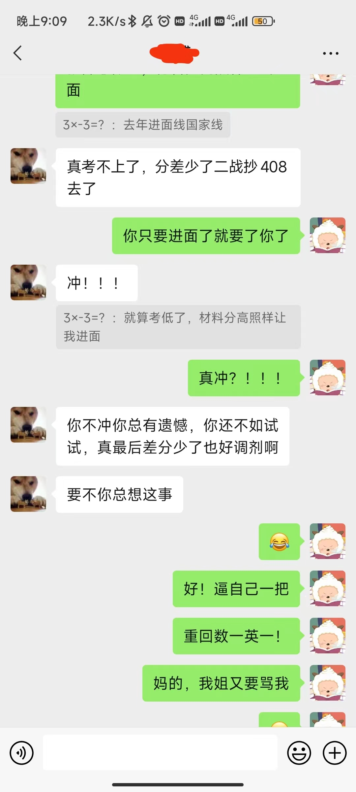

## 前言

我的备考时间很长，一年多，仅供参考，不建议拉这么长，~~如果我准备保研了是不是结果会不一样~~。

好在沉浮一年，似乎结果是好的，~~拟录取还没出，实际还是有点点点点慌~~。

能考就考，别放弃，相信天道酬勤😎

>
>
>warning：不适用于跨考同学

>
>
>终于出了，等传等的好苦，初复试第一成功上岸。

## 备考

我觉得可以分为三个时期，前期`1-6月份`，中期`7-9月份`，后期`10-12月份`

三个时期任务各有侧重，我会分开来写；一部分为我的备考经历，一部分为建议。

### 前期

实际上在暑假前都是前期吧我觉得，我是22年10月份就开始断断续续开始了，为什么说断断续续，因为我光~~小张~~的基础30讲前8讲，我学到了寒假还没学明白，而且中间其实花的时间也少，请读者自行略过，绝不建议这么早开始（~~浪费玩的大好时间~~）。

---

**数学**

真正开始是在23年2月份，这时候在家学了一段时间，纠结跟那个老师，从张宇老师到武钟祥老师到张宇老师，兜兜转转还是小张；我当时复习的方法不对，所以老是事倍功半，我练习题做的汤家凤老师的1800（**极不推荐！！！**），悔不当初啊，认准660！认准660！认准660！660基础阶段太适合了，~~虽然我是10月份才做的~~，感觉660不够的可以做张宇1000题**A组**，注意是只做A组，可不要学某个大笨蛋基础时去做ABC全部。

660讲解强推！！！👇👇👇看了直接顿悟

[官方授权｜25考研数学《基础过关660题》逐题超精讲（数一二三持续更新）_哔哩哔哩_bilibili](https://www.bilibili.com/video/BV14T4y1n7Ec/?spm_id_from=333.337.search-card.all.click&vd_source=8d88992bb4c0bfded89de60af69a7db3)

至于进度，建议最晚暑假前（7月）完成基础30讲

**英语**

英语的话，就背单词就好了，单词很重要，每天一二百个吧，一开始背的慢无所谓，慢慢加量，我当时一天300个吧差不多，我背单词很快。暑假前至少得来一轮吧，我感觉得至少来个两轮。根据自己调整吧，好多朋友告诉我背不过，逼逼自己吧，想考上得吃点考研的苦是吧\^o^/

这里点名批评我的**好朋友YHB**，不背单词，含泪落榜。

顺便再看看田静老师的句句真言，学学语法课，课程时间不长，每天学会，很快的，对于英语一来说，语法还是有些重要的。暑假前英语就这些任务

**专业课408**

我是学的408，所以自命题的可以划走了。

3月开始的，顺序：数据结构->操作系统->计算机组成原理->计算机网络

数据结构我一开始犯了个大错，看完用电脑实现算法，可前往别学我，浪费时间x2，我进度其实很慢，因为课多，加上方法不对，我4月底吧，才结束数据结构。

操作系统我5月开的，结果放假（6月中旬）回家了用了几天才学完。

计组和计网就是8月中旬前弄完了。之后就是强化课程

强化前只做选择题就行，还有笔记问题，我觉得写书上就好了，没必要整个笔记本，强化时可以整个

**综上**，前期比较轻松，不用管政治，每天6到8个小时就行了，大部分时间给专业课和数学，累了就玩，没必要绷很紧，还有最最最重要的就是，一定要相信自己能考上^o^y

### 中期-暑假篇

当你走到这里时，已经6月中旬了，真正的考研才开始。没学校课程的打扰了，现在你生活里只有两个字**复习**，此时每天学习10个小时左右了，而且需要认真学，注意力集中。

我当时回家后，每天7点起（虽然偶有起不来半点才起），半点就开始学习，一上午全是数学，12点吃饭。

中午休息到两点开始（~~其实我是想两点半的，奈何我姐那位高尚的研究生会嘴遁我，只好无奈两点~~），一直到下午6点半左右，下午全是专业课。

晚上的话，7点到10点半，8月份之前晚上全是英语，8月后我开始了政治，晚上就是政治+英语

---

**数学**

数学最晚7月吧，开始强化，强化课程时长也很长，笔记我还是推荐写书上，笔记本可以整理些常见套路，比如中值定理技巧什么的，自己总结总结还是有好处的。

做题的话，880+1000题B、C组就ok了，880感觉质量不太行了，很多都是改的真题，这个就仁者见仁智者见智了，我是这么搭配的；如果你660基础打的好的话，1000题会很好多，不像某个同学，一道积分算一天，大笨蛋┭┮﹏┭┮。

至于结束时间，我9月开了学还没完，概率论还剩一半，也差不多了。

题目讲解的话，880还是推荐[小吴学长啊]([小吴学长啊的个人空间-小吴学长啊个人主页-哔哩哔哩视频 (bilibili.com)](https://space.bilibili.com/487537846?spm_id_from=333.337.search-card.all.click))，但是880只会在b站免费一部分，剩下的是付费，建议拼夕夕购买网盘，大概11月才会更完吧。1000题就没办法了，b站有其他up的免费讲解，但是感觉不如小吴的细（说白了就是我基础差听不太明白），~~也许是我基础时不做660基础不牢的缘故~~

接下来的内容**triple star** ⭐⭐⭐

- **高数**
  - 高数有一节是**三重积分**，讲曲面和曲线积分的，这个必考必考必考！！！，12分你要不要，必须把这个学会，考的题目不会很难，所以必须掌握。
  - **证明题**，我建议不要死磕，你不是去考150的，做个第一问拿保底就行了，当然你要想知道想拿满分怎么办，我也不知道呀，我很菜的，呜呜呜
- **线性代数**
  - 好好学，计算能力很重要，这个我给不了太多建议，因为我考研线代题目没拿满分😿

- **概率论**
  - 这个是我最怕的科目了，感觉真的好难，但其实考研考的不难。我的概率论复习之路也是崎岖不已，学这个让我怀疑人生，虽然高数和线代也是。我的建议是别怕，认准小吴，等看到后期篇你会知道为什么的
  - 这个要冲着尽量满分去复习，我忘了满分多少了，总之概率论的真题算三门数学里好拿分的
- **计算能力**
  - 这可以是我的痛点了，自高中`6+7=12`以来，一直保持着优良的水准，按照今年老头出题的情况老看，计算能力很重要，但我一直没找到好方法解决，这个就靠你们了，务必不要眼高手低，一道题算就把它算完。

我从强化开始全跟的宇爹了，~~如果不算后期自己搞自己转数二又转回数一的话~~

---

**英语**

这个时候英语就要出场了，开始看阅读课，看完刷阅读真题，一天两篇，好好复盘，晚上可以全给英语，阅读课时长不算很短的。至于阅读课，强烈推荐[颉斌斌老师]([颉斌斌老师的个人空间-颉斌斌老师个人主页-哔哩哔哩视频 (bilibili.com)](https://space.bilibili.com/271970833?spm_id_from=333.337.search-card.all.click))，我先看的唐迟老师的，但是感觉还是颉斌斌老师比较好，可以都看看，自行取舍。

暑假前基本只需要做阅读，找技巧，最多刷到15年吧，刷完还要二刷，这就要求你做题要用铅笔，或者在草稿纸上写答案。进度快或者阅读掌握的好就可以再做做新题型什么的，反正我是没做，我到10月份还在刷阅读，那时候才顿悟，~~我承认我是大笨蛋呜呜呜~~

假如你上一个阶段单词还没背完或者没背熟，直接会影响你做阅读的，所以，一步一步走很重要，暑假的你会感谢春天的你的。

---

**408**

又双叒到了我怕们最熟悉（却最不会做题）的专业课了。

暑假除强化外，看基础视频时一如既往。

建议你看完4本书基础视频时，自己花个两天复习下，因为此时距离你看完数据结构可能已经过去3个多月了。

**强化-tips**

- 王道强化视频很短，相较于基础课程，强化一定要做笔记，找个笔记本，分4块，记四本书的强化，强化顺序应该是先数据结构，计组，os，计网这样
- 计网更新完估计10月底了吧，7月开始更强化，今年好像4门都是咸鱼讲了，以前计网是个女的，质量不如咸鱼
- 这阶段你怎么做题王道强化课会告诉你的，听他的就好。
- 还有不要崩溃，相信自己，408就是有难度的，学不会也不怪你，你坚持到这里你已经很厉害了👍

---

### 后期

此时你已经9月份开学了，你的朋友圈从暑假朋友们到处玩，开始要逐渐变成保研人的一路生花了，考研人最惨的一段时光来了😓

你会经历非985不考------>211也还行------->有学校要我就行🤡

不过**别怕**，你好多对手都在这里放弃了，但你不行。

注意真题最好都留个3套11月/12月进行模拟用

---

- **数学**
  
  - 现在10月前你要结束所有强化，别学我，数一被搞心态了9月开学突然转数二了，扔下概率论不管了，10月底又突然转回来了，11月份初大家在做真题我在女娲补天概率论，呜呜呜~。如果不是小吴学长880讲得透彻，我概率论估计也补不回来。再次点名支持我的好兄弟**YHB**，感谢，不然我会后悔终生
  
    
  
  - 1000题和880完了之后我是不建议二刷，浪费时间，直接10月份开真题就行了，我是开的真的很晚，导致差点没做完
  
  - 真题可以留个进3年的，自己11月模拟下
  
  - 除真题外还有，《张宇8套卷》《李林6套》《张宇4套》等等等，我建议是张宇的必做，也有说李林的都做，多买几套做做吧，不吃亏，等10月了你就自然而然知道买哪个了
  
  - 注意做笔记，勤复盘，看看自己是计算错误还是公式不牢
  
  - 真题最晚11月中旬前刷完吧，毕竟还有十几套模拟题。一到12月政治会折磨你的，耗费大量时间
  
    
  
- **英语**
  - 此时你在二刷阅读，或者做着15年之后的题了，阅读要靠自己悟，我是10月份某天突然顿悟的，还有还不要去做英二的阅读，绝对不要！！！英一英二思路不一样，别理英二
  - 也要去做新题型和完型填空，至于看谁的课，我就不好说了，可以先自己试着做几篇，看看情况怎么样，除阅读以外的所有英语题型从10年开始，二刷阅读也从10年开始，而且10年刚开始分英语1英语2老头没把握好出题难度，你做不好不怪你，怪老头
  - 翻译的话，有个老师叫唐静（仅限英1，英二翻译简单不行不用看），看盗版课就行，也不用买教材，也没教材，英语就用你那个真题就行
  - 作文的话，10月也该看了，我是11月开始的，呜呜呜，进度再次落后；我看的周思成的，你问我为什么看他的？因为我姐看的她，她让我看他。他有个万能模板，反正背了就会写大作文，我也不知道我英语作文多少分，这个老师也仁者见仁智者见智吧。Tip：有点娘
  
- **专业课**
  - 强化完再开始真题，真题刷完可以做做王道的模拟8套
  - 模拟8套大题有的比较怪，毕竟王道自己出的，可以不做，选择就都做做吧
  - 真题要二刷，甚至三刷，重刷的时候可以侧重年份新点的题目
  - 10月份王道还会更个让你捡起来基础视频的视频，也不长，但我感觉没用，自己看着取舍吧
  - 真题什么时候刷完，我觉得大概11月？我进度算慢的，12月还在二刷三刷，最后模拟是在12月10号左右，做的最后一套408真题
  
- **政治**
  - 我八月份开始的，看徐涛的核心考案，看完做肖秀荣1000题，直接开两倍速看，快的话一个月就完事了，视频挺长的，但不建议很早开始，8月中下旬也可以的，9月初也行
  - 9月开了学你要买背诵手册，腿姐的或者肖秀荣的都行
  - 政治不需要真题！！！
  - 政治严格来说分为选择题和大题
  - 大题是11月底再开始背的，刚进12月也行
  - 选择题的话，做肖1000题，多做几遍（反正都说刷好几遍，但是一道考场一看一个原题类似题都没有，哭死）；看完徐涛的视频可以去看腿姐的选择技巧课，9月开更，一个多月更完
  - 大题我是认准的腿姐，一般不是背腿姐就是跟肖4，12月也会有腿姐9页纸，是真要下功夫背啊，挺多的

9月会有预报名，10月底正式报名。9月起到真正考前这段时期很难熬，每天复习11小时左右，每天吃饭就是休息，回宿舍发现舍友还很轻松，在玩，你内心更是：我\**\***\*。做过的题还是错，单词怎么还是有些记不住，专业课学不完，数学学不完，英语学不完，政治搞不懂，怎么别人做的那么好，网上一看，各种模拟哥，分好高啊。三天一小崩两天一大崩，每天都是我能考上😎我考不上😭反复横跳。

坚持下去吧，可以去B站看看鸡汤视频，想考上就得吃考上的苦，宇爹说的一句话很好

>
>
>不要**光有雄心壮志**，这样是远远不够的，真正遇到了困难，那个苦头吃不吃得下去，才能决定你是否能成功，而不是你的目标是否远大，而不是你的道德是否高尚，遇到难事了才能看出你是不是真的能走下去。        
>
>答应了自己要考上，就一定要考上。                                                                                                                 ————张宇

加油别放弃，考上了的一定是坚持下来的，哭着考完，笑着上岸。

## 书＆题-购买指南

我猜肯定有人耐不住了，一定在想，怎么不告诉我什么时候买真题？什么垃圾考研教程啊！

>
>
>先别骂，我只是想单独写下购买指南。

以下是你的购买清单：

- **前期**

  - [ ] 《基础30讲》
  - [ ] 《张宇1000题》
  - [ ] 《句句真言》 此为田静语法课教材
  - [ ] ~~《墨墨背单词》~~随便个背单词App即可
  - [ ] 王道4本
  - [ ] 《基础过关660》

- **暑假**

  - [ ] 《考研真相》 or 《小黄书》？可能是叫这个，英语真题，哪个都行
  - [ ] 《强化36讲》
  - [ ] 《880》
  - [ ] 《核心考案》徐涛+《肖秀荣100题》，这是政治教材和题目

- **后期**

  - [ ] 《408历年真题》
  - [ ] 《王道8套卷》
  - [ ] 《腿姐背诵手册》or 《肖秀荣背诵手册》
  - [ ] 《数学历年真题》03年及以后
  - [ ] 《肖4》《肖8》（选）我就用的pdf
  - [ ] 《张宇8套卷》《李林6套》《张宇4套》等等等

  

  

>
>
>注：某些并非真正书名，例如《数学历年真题》，但是直接搜我给的内容一定可以搜出来的
>
>以上内容可能不全面，待补充
>
>另：我全用的盗版教材，没有买过正版书，穷苦学生一枚呜呜呜🫡。网课买盗版教材商家会有网盘群的，也可以去公众号《研池大叔》那里面找。

## 后记

很早就想搭个博客，给你们写个考研相关的文章，没想到一言难尽啊，中午吃完饭不到一点开始弄，一直到现在8点半才写道这里，搭建太麻烦了，~~一定不是我太笨的缘故~~

以上有待补充，后续会逐渐完善，省的你们老是问我重复的问题。

---

另外，感谢2023的自己，这段经历我永远不会忘记，谢谢你，辛苦你了。

我仍记得刘晓燕老师曾说过

>
>
>你总该奋斗一次吧，你都活了20年了，你做过一件事就现在你想一下有没有让自己感动的浑身热血沸腾眼泪都能哭出来，跟别人讲一下你眼泪都能流出来。

截至2024年4月1日，我积攒了两次奋斗，一个是我的高三，一个是我的考研。

无论怎样，我都坚持下来了，我所能做的仅是这样了，希望当你明年出成绩时，也会被你的分数所惊讶到。

考研难难在人，我不知道备考时崩溃了多少次，高考时一次没哭过，考研时11月份左右，真的顶不住了，无以言表，经历过才知道有多难。出分那天我永远忘不了，分数出来的那一刻，才是真的感觉一年没白费，是真顶不住，泪如泉涌，我真的付出太多太多太多了，我可以失败，但决不接受失败。我把考研看的很重，算是对自己偏离的人生的又一次弥补吧，这次，我又做到了。

---

**TO：未来的研究生**

我不想神化考研，但是只要你是想考上，这个苦你必须得吃的下去，游戏暑假后该删就删，别觉得一天11个小时很多，谁不累啊，别睡懒觉，坚持下去，不许二战，加油。

## Q＆A-问题解答

### 在哪看课程视频？

我全用的盗版教材，没有买过正版书，穷苦学生一枚呜呜呜🫡。网课买盗版教材商家会有网盘群的，也可以去公众号《研池大叔》那里面找（里面也是网盘链接）。

### 408代码题怎么写？没学过C/C++？

- 如果你学过c/c++，那就等强化时看课就行了

- 没学过的话，只要有编程基础就行，强化时学会怎么定义数组，结构体，怎么用指针就行了。
- 什么？你是跨考的？不好意思，那就前期学学c吧

另附一张真题代码图，以供参考👇👇👇

### 11408不知道考哪里？

💕💕💕北京211**点击就送**💕💕💕

⭐⭐⭐毕业薪资**20K**起步，上不封顶⭐⭐⭐

😎😎😎毕业直通米哈游😎😎😎

欢迎报考[中国传媒大学](https://yz.cuc.edu.cn/)

### 专业课要背吗？

要，也不要。

平时做题就自然而然记住了吧，毕竟是理科。

但是有的概念或者必须记得还是要记住的：

- 数据结构里哈希的三个评价指标，这得记住
- 还有像计网里IP地址多少位，这些学过自然而然就记住了

基本上不需要死记
